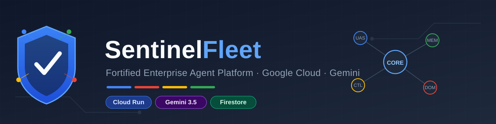

# SentinelFleet — Fortified Enterprise Agent Platform & OmniLedger Taskmaster

[](https://cloud.google.com/run)
[](https://deepmind.google/technologies/gemini/)
[](#security--governance)
[](https://googleapis.github.io/python-genai/)
[](tests/)
[](LICENSE)

> Built for the **Google Cloud All Things Agentic Hackathon** (Track 3: The Fortified Enterprise Fleet & Track 1: The Taskmaster).

---

## 🌟 Executive Summary

**SentinelFleet** is an enterprise-grade AI agent control plane and autonomous taskmaster platform built with **Gemini 3.5 Flash Vision** via the **Google GenAI SDK (`google-genai`)**, **Google Cloud Run**, and **Google Cloud Firestore**.

It solves the two largest challenges of enterprise agent adoption:
1. **Governance & Zero-Trust Security (Platform Layer):** Centralized Agent Lifecycle Registry, Zero-Trust Model Armor against Prompt Injections, granular Principle of Least Privilege (PoLP) tool isolation, USMC Memory Bank, DSGVO Privacy Contact Hub, and OpenTelemetry reasoning traces.
2. **Autonomous Messy Chores (Domain Layer — OmniLedger Taskmaster):** An end-to-end background document and invoice reconciliation workflow with § 14 UStG tax compliance validation, automated Human-in-the-Loop approval gates, and a **Self-Healing Vendor Dispute Loop**.

📖 **Full Technical Manual:** See [docs/SENTINEL_FLEET_SYSTEM_MANUAL.md](docs/SENTINEL_FLEET_SYSTEM_MANUAL.md) for deep architectural specifications.

---

## 🏛️ The 4 Pillars Architecture

SentinelFleet is architected across four modular pillars:

```
┌──────────────────────────────────────────────────────────────────────────────────────────────────┐
│                                     SENTINEL FLEET ARCHITECTURE                                  │
├──────────────────────────┬──────────────────────────┬─────────────────────────┬──────────────────┤
│ 1. CONTROL (Governance)  │ 2. MEMORY (State & RAG)  │ 3. UAS (Human Interface)│ 4. DOMAIN (Task) │
├──────────────────────────┼──────────────────────────┼─────────────────────────┼──────────────────┤
│ • Zero-Trust Gateway     │ • USMC Memory Bank       │ • TicketMaster (HITL)   │ • OmniLedger     │
│ • Model Armor Defense    │ • GARDENER FTS & RAG     │ • TaskMaster State      │ • § 14 UStG      │
│ • Clutch Model Router    │ • MemoryHooker Clues     │ • Interactive Dashboard │ • Dispute Loop   │
│ • PII Sanitization       │ • Evidence Synthesizer   │ • Swarm Conductor       │ • Auto-Booking   │
│ • OpenTelemetry Spans    │ • Firestore Persistence  │ • Circuit Blueprint Map │ • DSGVO Contacts │
└──────────────────────────┴──────────────────────────┴─────────────────────────┴──────────────────┘
```

---

## 📇 DSGVO Privacy Contact Hub & Address Book

Synthesizing proven local privacy concepts, SentinelFleet includes a GDPR / DSGVO-compliant address book:
* **S1–S4 Protection Levels:** Strict retention timers (S1: 6m, S2: 12m, S3: 36m for tax records under § 147 AO, S4: permanent partner).
* **Tombstone Protection:** Deleted or unsubscribed contacts remain locked as tombstones to prevent autonomous agents from re-adding them or sending unrequested emails.
* **Pre-Send Verification:** Every automated supplier notice is audited against the contact hub before dispatch.

---

## 📝 32 Enterprise Skills Catalog (Component-v1)

SentinelFleet ships with 32 canonical, Google-Cloud-branded enterprise skills across all 4 pillars:
* **Domain (7):** `tax-compliance-v1`, `pdf-vision-extractor`, `multimodal-imap-grabber`, `autonomous-vendor-dispute`, `tax-reconciliation-ledger`, `ustg-law-compliance-checker`, `google-web-reading`.
* **Control (6):** `model-armor-sentry`, `model-armor-defense-guard`, `preflight-guardrail-enforcer`, `pii-redactor-and-sanitizer`, `sentinel-persona-router`, `adaptive-llm-router`.
* **UAS (6):** `task-lifecycle-maintainer`, `gemini-dag-orchestrator`, `hitl-triage-master`, `cloudrun-swarm-conductor`, `cloudrun-adaptive-scheduler`, `cloud-pubsub-event-mesh`.
* **Memory (5):** `memory-bank-connector`, `dynamic-context-injector`, `multimodal-document-chunker`, `chain-of-evidence-reasoner`, `controlcenter-skill-discovery`.
* **Assist, Dev & Utilities (8):** `google-calendar-scheduler`, `gemini-audio-transcriber`, `fleet-dossier-briefing`, `canva-ui-stylist`, `audit-incident-protocol`, `runtime-anomaly-detector`, `enterprise-plugin-engine`, `gemini-bilingual-sync`.

---

## 💬 Governed Chat Console & Model Race

The operator console carries a chat tab in which **every model call takes the same path as the
document pipeline**: `model_armor.inspect_prompt` scans the message, then
`gateway.execute_tool_call` runs it under a registered agent identity with that agent's
least-privilege scope, PII sanitisation and permission gate. There is no second, unguarded route
to a model.

* **Composed system prompt:** fleet base prompt + the bodies of the skills you select from the
  registry + one **pinned version** of a prompt template. Pinning matters: a later version bump
  cannot silently change what a recorded conversation ran on.
* **Race mode:** one prompt, two or more models, dispatched with `asyncio.gather`. Each lane runs
  under its **own agent identity** (`agent:race-lane-1..4`) because the gateway locks per agent —
  lanes sharing an identity would queue and the latencies would measure the queue. Optional judge
  scores the lanes on quality, correctness, completeness, instruction fidelity and latency;
  latency is one dimension, not the ranking.
* **Export:** any transcript as Markdown, plain text, styled HTML or PDF. Every exported turn
  carries the mode it ran in, so provenance survives leaving the console.
* **Honest demo mode:** without `GEMINI_API_KEY` the console answers with the request it actually
  assembled and labels the turn `demo`, rather than presenting invented text as a model reply.
  The judge refuses to score demo lanes outright — a labelled simulated latency is still a number,
  an invented quality rating would be fabricated evidence.

---

## 🗓️ Tasks & Routines

Everything the fleet runs is a `TaskTemplate` — a prompt (custom or a pinned library version)
plus a skill selection, an assigned agent and an approval flag. A template describes *what*
should happen, never *when*. Attaching a `RoutineBinding` (recurring: interval / daily / cron)
or a `ScheduleBinding` (a one-off `due_at`) turns it recurring or dated; removing both bindings
leaves a bare, deletable template again — a template never migrates between object types. The
gear/clock badges and the running/preparing/idle status dot in the **Task templates** table
(Fleet tab) are all derived on every read from the bindings and the task queue, never stored.

Running a template goes through the same `SovereignGateway` path as the chat console — an agent
identity, model armor, permission gate — and produces a real `TaskRecord` in the existing Task
queue (tagged with its `source_template_id`, so a template run is a view of that one queue, not
a second list). Without `GEMINI_API_KEY` it answers in the same honest deterministic-demo mode
as everywhere else in this app.

**`POST /api/routines/fire`** is the trigger target for **Google Cloud Scheduler**: SentinelFleet
runs on Cloud Run with scale-to-zero, so there is no in-process tick loop — Cloud Scheduler wakes
the service and calls `/fire`, which enqueues whatever routine or one-off schedule is due and
applies each binding's `skip`/`catch_up` policy to anything missed while the service was scaled
down. The endpoint is idempotent by construction (firing always pushes the next due time
forward) and, for local development, open with a logged warning unless `ROUTINES_FIRE_TOKEN` is
set — a real deployment should set it and have Cloud Scheduler send it as `X-Fire-Token`, or call
the endpoint through an OIDC-authenticated Cloud Run invocation instead.

---

## ⌁ Architecture Blueprint: Two Views

`/blueprint` serves the pipeline walkthrough and a **module interdependency circuit**. The circuit
is not drawn by hand: every node is a module under `src/sentinel_fleet` and every trace is an
import statement parsed out of it with `ast` on each request, laid out so an importer sits left of
everything it imports. Hover a module to isolate what it wires into. The diagram cannot drift from
the code, and the test suite checks every edge back against the importing module's source.

---

## ⚡ Quickstart (Local & Google Cloud Run)

### 1. Local Run
```bash
# Clone the repository
git clone https://github.com/ellmos-ai/sentinel-fleet.git
cd sentinel-fleet

# Install dependencies
pip install -e .

# Start the Control Center Web App
python app.py
```
Open **`http://localhost:8080`** for the operator console, the chat and race tabs, and the architecture blueprint.

### 2. Run Tests
```bash
python -m pytest tests/ -v
```

---

## 🔒 Security & Model Armor

* **Zero-Trust Tool Scoping:** Agents only have access to their assigned tools via `gateway.py`.
* **Adversarial Injection Detection:** Regex and semantic boundary matching in `model_armor.py`.
* **Quarantine Protocol:** Malicious inputs immediately quarantine the executing agent and notify the operator via high-priority TicketMaster tickets.

---

## License

Copyright (C) 2026 Lukas Geiger.

SentinelFleet is licensed under the **GNU Affero General Public License v3.0** (AGPL-3.0-only) — see [LICENSE](LICENSE). If you run a modified version of this software as a network service, the AGPL requires you to offer its source to your users. For commercial licensing outside the AGPL terms, contact the author.

## Scope, Provenance & Data Notes

* **Demo, not advice.** The OmniLedger domain validates demo invoices against German statutory rules (§ 14 UStG, GoBD) as a technical showcase. It is an AI-assisted engineering demo — not tax, accounting or legal advice; whether any concrete use meets statutory requirements depends on the individual case.
* **Provenance.** Built by Lukas Geiger for the Google Cloud All Things Agentic Hackathon with substantial AI coding assistance (Google Gemini, Anthropic Claude); all AI-generated code was human-directed and is covered by the 149-test suite. Some skill definitions are English rebrands of the author's private skills library.
* **Data.** Chat and document uploads may be sent to the Gemini API when a `GEMINI_API_KEY` is configured; without a key the console runs in a labelled deterministic demo mode and nothing leaves the process. Do not upload real invoices or personal data to a demo deployment, and please do not post case data in issues.
